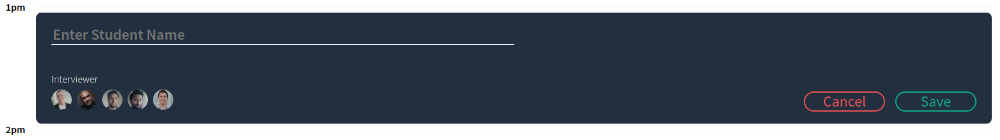
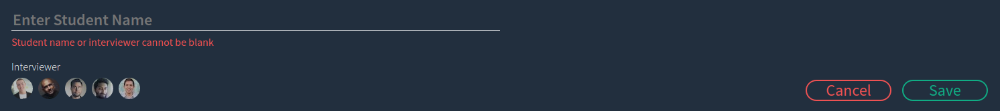
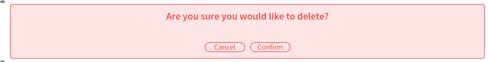
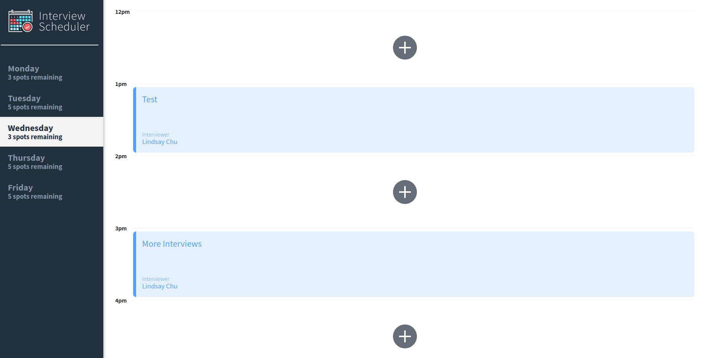
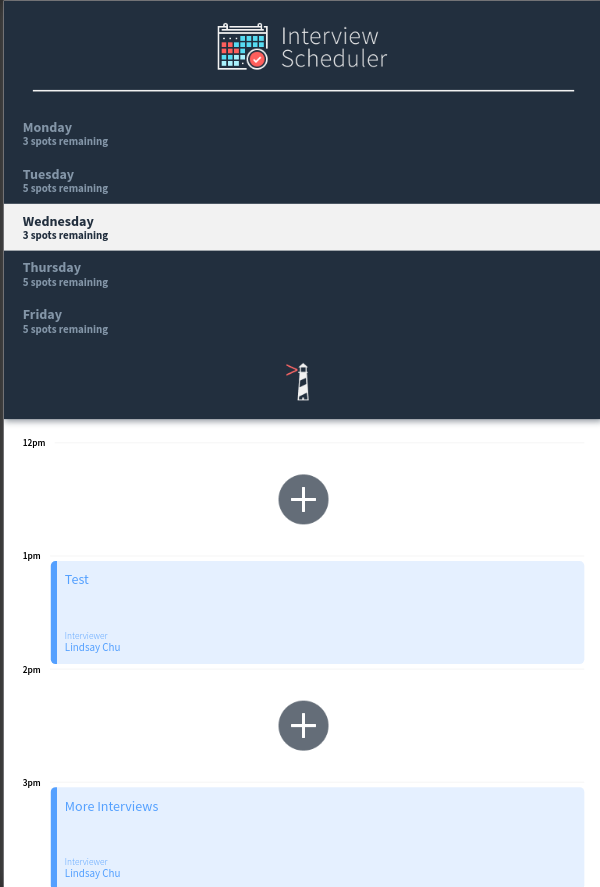

# Scheduler
A React app that allows users to book, edit and cancel interviews. Data is persisted by the API server using a PostgreSQL database hosted on Heroku.
Jest and Cypress testing suites are used throughout the development of the project. 
The client application communicates with a WebSocket server, when a user books or cancels an interview, all connected users see the update in their browser. 

## Deployed

The site is live and deployed [here!](https://interview-scheduling-app.netlify.app/)

## Screenshots
  - Landing page


  - Show View



  - Error view when name or interviewer selected is blank



  - Saving Interview View


  - Confirmation of deleting interview



  - Updated Spots on day select



  - Responsive Design



## Dependencies

- Axios
- Classnames
- Cypress
- Normalize.css
- Prop-Types
- React
- React-dom
- React-scripts

## DEV Dependencies

- @babel/core
- @storybook/addon-actions
- @storybook/addon-backgrounds
- @storybook/addon-links
- @storybook/addons
- @storybook/react
- @testing-library/jest-dom
- @testing-library/react
- @testing-library/react-hooks
- node-sass
- react-test-renderer

## Database API Deployment 
  - Database API deployed on Heroku.
  - To access the database make GET requests to https://interview-scheduling-app.herokuapp.com/api/...

## Client Deployment
  - Client is deployed on Netlify at https://interview-scheduling-app.netlify.app/

## Continuous Testing Integration
  - Continuous CI deployed with CircleCI

## Setup
1. Fork this repository, then clone your fork of this repository.
2. Install dependencies using the `npm install` command.

## Running Webpack Development Server
```sh
npm start
```

## Running Jest Test Framework
```sh
npm test
```

## Running Storybook Visual Testbed
```sh
npm run storybook
```